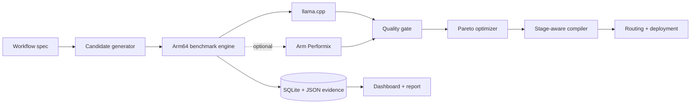

# A64Forge

**Autonomous Optimization Compiler for AI Agents on Arm64**

> Most AI agents use oversized models and generic inference settings for every stage. A64Forge profiles each stage, searches model and runtime configurations directly on Arm64 hardware, protects a user-defined quality threshold, and compiles the result into an optimized deployment backed by reproducible benchmark evidence.

The verified dashboard can be reproduced locally from the public evidence artifact using the commands below.

A64Forge is not a chatbot and not a static benchmark dashboard. The optimization system is the product: workflow specification → bounded real experiments → deterministic quality gates → Pareto frontier → stage-aware routing → portable evidence and deployment artifacts.

## Why this exists

A five-stage agent commonly routes classification, extraction, tool selection, reasoning, and summarization through the same large model. That is easy to deploy, but it may waste memory and CPU time. A64Forge measures whether smaller or differently quantized models can serve individual stages without violating the workflow’s quality floor.

It answers a workflow-level question:

> Which combination of models and runtime configurations gives this entire multi-stage workload the best measured quality/performance tradeoff on this exact Arm64 machine?

## Verified Arm64 result

Run [`run-1488b44fa409`](https://github.com/webski101/a64forge/actions/runs/31646296185) measured 20 candidates on a native `aarch64` GitHub runner at commit `b414b9e`. Against the measured all-Qwen3-4B Q4 workflow baseline (`large:Q4_K_M:t1:b64:c512`), the balanced stage-aware routing achieved:

| Workflow-average metric | Baseline | A64Forge | Change |
| --- | ---: | ---: | ---: |
| Median stage latency | 12,248.46 ms | 3,947.69 ms | **67.8% lower** |
| Peak RSS | 4,897.91 MB | 2,796.18 MB | **42.9% lower** |
| Throughput | 5.93 req/min | 20.43 req/min | **244.5% higher** |
| Deterministic quality | 0.875 | 0.933 | **6.7% higher** |

These aggregates are derived from measured records in one artifact; they are not cross-host estimates. Classification and tool selection retain Qwen3-4B, extraction uses Qwen3-1.7B, and reasoning and summarization use Qwen3-0.6B. The 0.80 workflow quality gate remains enforced.

## What works

- `a64forge doctor`: real OS, architecture, CPU, core, RAM, disk, Arm feature, llama.cpp, llama-server, llama-bench, and Performix detection.
- YAML workflow adapter and a conservative decorated-Python adapter.
- Configurable, license-documented local GGUF registry.
- Memory/time/candidate safety limits and an explicit configured baseline.
- Real llama-server subprocess execution with model-load health checks, warm-ups, repeated runs, response timings, wall latency, RSS/CPU sampling, model/dataset hashing, and structured failure artifacts.
- Exact match, structured field accuracy, tool accuracy, reference coverage, and factual coverage without a paid judge model.
- Four-objective Pareto frontier: latency, memory, throughput, and quality.
- `latency`, `memory`, `throughput`, `balanced`, and `quality` presets with published weights.
- SQLite metadata plus JSON evidence; portable HTML/JSON reports.
- Stage-aware `routing.yaml`, model manifest, Arm64 Docker output, and deployment README.
- FastAPI system/benchmark/optimization/model routes, OpenAI-compatible proxy route, workflow route, and live SSE progress.
- React dashboard with Overview, Workflows, Optimization Lab, Benchmarks, Arm System, and Reports.
- Development mode that says `DEMO DATA` or `UNVERIFIED RUN`; it cannot mint a verified Arm record.

## Architecture



See [docs/architecture.md](docs/architecture.md) and [docs/research.md](docs/research.md).
Full measurement provenance: [docs/VERIFIED_RESULTS.md](docs/VERIFIED_RESULTS.md).

## Why Arm

The Cloud AI track explicitly includes Arm64 CPU inference, quantization, llama.cpp, and agentic workloads. Current llama.cpp includes Arm-contributed kernels and reports architecture capabilities such as NEON, SVE, FMA, and MATMUL_INT8 when present. A64Forge captures that evidence. It never equates “deployed to an Arm-branded service” with measured Arm execution.

## Quickstart for development

```bash
python -m venv .venv
# Linux/macOS
source .venv/bin/activate
# Windows PowerShell
.venv\Scripts\Activate.ps1

python -m pip install -e ".[dev]"
cd frontend
npm install
npm run build
cd ..

$env:A64FORGE_DEV_MODE="true"  # PowerShell
a64forge doctor
a64forge analyze examples/research_agent
a64forge serve
```

Open [http://127.0.0.1:8640](http://127.0.0.1:8640). Development mode shows no invented benchmark data.

To inspect a verified artifact on a non-Arm development machine:

```bash
a64forge import-evidence a64forge-arm64-evidence-31646296185.zip
a64forge optimize --run-id run-1488b44fa409 \
  --baseline large:Q4_K_M:t1:b64:c512 --target balanced
a64forge compile
a64forge report
a64forge serve
```

The dashboard labels captured hardware as imported evidence; it does not claim the current development computer is Arm64.

## Run on Arm64

```bash
./scripts/setup_arm64.sh
source .venv/bin/activate
export A64FORGE_DEV_MODE=false
export A64FORGE_LLAMA_SERVER="$PWD/.a64forge/llama.cpp/build/bin/llama-server"
python scripts/download_models.py

a64forge doctor
a64forge benchmark --max-memory 12 --max-runtime 3600 --max-candidates 20
a64forge optimize --target balanced
a64forge compile
a64forge report
a64forge serve --host 0.0.0.0 --port 8640
```

### Free native Arm64 run with GitHub Actions

No persistent cloud VM is required. Push the project to a public GitHub
repository, open **Actions → Native Arm64 benchmark → Run workflow**, and
download the generated evidence artifact when it completes. The workflow uses
the separate bounded `configs/github-arm64.yaml` profile and never replaces the
default production profile. See [the GitHub Arm64 runbook](docs/GITHUB_ARM64.md).

The default registry downloads roughly 12.5 GB if every variant is selected. For an affordable first pass, edit `configs/default.yaml` to keep one small, one medium, and one large Q4/Q8 variant. Budget at least model file size × 1.25 plus KV cache and system headroom; 16 GB RAM and 32 GB free disk are conservative demo targets.

Full instructions: [docs/RUN_ON_ARM.md](docs/RUN_ON_ARM.md).

## CLI

```text
a64forge doctor [--json]
a64forge init [DESTINATION]
a64forge analyze PATH
a64forge import-evidence ARTIFACT.zip
a64forge benchmark [--max-memory GB] [--max-runtime SEC] [--max-candidates N]
a64forge optimize --target latency|memory|throughput|balanced|quality [--baseline CANDIDATE_KEY]
a64forge compile [--destination PATH]
a64forge report [--destination PATH]
a64forge autopilot
a64forge serve
```

Demo fixtures, when needed for UI development, must be imported explicitly:

```bash
a64forge benchmark --demo-data path/to/fixture.json
```

Every imported record is forcibly labeled `DEMO DATA` and `verified_arm64=false`.

## Benchmark methodology

Baseline and candidates run on the same host and stage dataset with the same generation limits. The configured baseline is always included. Each candidate receives warm-up requests followed by multiple measured passes. Records contain median and p95 request latency, prompt/generation throughput when exposed by llama-server, process RSS/CPU observations, load time, model bytes, model SHA-256, dataset SHA-256, configuration, Git commit, and host evidence.

The balanced preset is:

```text
0.35 × normalized latency
+ 0.20 × normalized memory
+ 0.20 × normalized throughput
+ 0.25 × normalized quality
```

Latency and memory scores are inverted because lower is better. Only candidates satisfying `minimum_quality` and `maximum_quality_drop` reach the Pareto frontier. Exact details are in [docs/BENCHMARKING.md](docs/BENCHMARKING.md).

If any workflow stage has no qualifying candidate, optimization returns an
explicit `NO QUALIFYING CANDIDATE` result instead of discarding the completed
measurements. Reports identify the rejected stages, while compilation emits
only a non-deployable manifest, benchmark summary, and warning README. Routing
and Docker deployment files are withheld.

## API

```text
GET  /health
GET  /system
GET  /models
GET  /workflows
GET  /benchmarks
GET  /optimizations
GET  /events
POST /actions/benchmark
POST /actions/optimize
POST /actions/compile
POST /actions/report
POST /v1/chat/completions
POST /v1/workflows/{workflow}/run
```

`/v1/chat/completions` proxies only to a configured local llama-server (`A64FORGE_UPSTREAM_URL`). It never silently calls an external model API.

## Generated deployment

`a64forge compile` writes:

```text
dist/
├── a64forge-manifest.json
├── routing.yaml
├── models.yaml
├── benchmark-summary.json
├── Dockerfile.arm64
├── docker-compose.yml
└── README.md
```

`a64forge report` writes `reports/<run-id>/report.html`, `results.json`, and `manifest.json`.

## Environment variables

| Variable | Purpose |
| --- | --- |
| `A64FORGE_DEV_MODE` | Enables development mode. Never verifies Arm records. |
| `A64FORGE_CONFIG` | Project YAML path. |
| `A64FORGE_DB` | SQLite evidence path. |
| `A64FORGE_LLAMA_SERVER` | llama-server or current `llama` executable. |
| `A64FORGE_LLAMA_BENCH` | llama-bench executable. |
| `A64FORGE_MODEL_DIR` | Model download directory. |
| `A64FORGE_UPSTREAM_URL` | Local OpenAI-compatible llama-server URL. |
| `A64FORGE_FRONTEND_DIR` | Built dashboard directory. |

## Reproducibility and limitations

- This repository contains no claimed benchmark result. Final submission metrics must come from a real Arm64 run.
- TTFT is stored only when the runtime returns it; otherwise the UI says “Not measured yet.”
- Process RSS is a host-process observation, not a hardware memory-bandwidth measurement.
- Performix is optional because installation and command syntax are release/environment specific. A capture is reported only after a configured command succeeds.
- The MVP executes one candidate server at a time for isolation. The compiled manifest is reusable, while multi-instance scheduling is future work.
- Default model size fields are registry guidance; local model files are hashed and their actual byte sizes are recorded.

## Project docs

- [Arm setup](docs/ARM64_SETUP.md)
- [Benchmarking](docs/BENCHMARKING.md)
- [Demo script](docs/DEMO.md)
- [Devpost draft](docs/DEVPOST.md)
- [Official research](docs/research.md)
- [Real Arm runbook](docs/RUN_ON_ARM.md)
- [Free GitHub Arm64 runbook](docs/GITHUB_ARM64.md)

## Roadmap

LangGraph and llama-cpp-agent adapters, remote Arm workers, concurrent throughput experiments, Performix regression gates, vLLM/ExecuTorch/LiteRT runtimes, and distributed multi-model serving.

Apache-2.0. Contributions are welcome; see [CONTRIBUTING.md](CONTRIBUTING.md).
