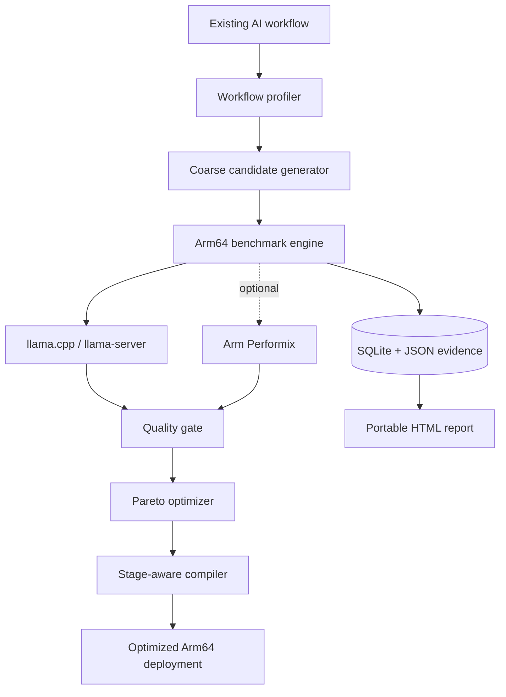

# Architecture

The benchmark engine never infers performance from parameter counts. It executes the configured runtime, records response and process metrics, evaluates stage-specific quality against deterministic fixtures, and stores the evidence. Only records produced on a detected `aarch64`/`arm64` host with development mode disabled receive `VERIFIED ARM64 RUN`.

